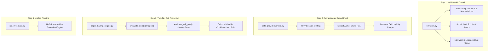

# Comparative Audit: `trading-bot` vs `omotrades/omo`

**Date:** 2026-08-29  
**Reference Repository:** [`omotrades/omo`](https://github.com/omotrades/omo)  
**Target Repository:** [`trading-bot`](file:///home/hixam/Downloads/Projects/trading-bot)  
**Methodology:** Direct source-to-source code review across pipeline orchestration, risk engines, model routing, social signal ingestion, on-chain execution, and cryptographic verification.

---

## 1. Executive Scorecard

| Subsystem / Dimension | `omotrades/omo` | `trading-bot` (Your Repo) | Leader |
| :--- | :--- | :--- | :--- |
| **Model Routing & AI Hierarchy** | **Council of Minds:** Dedicated roles (Opus 5 + Grok 4.1) with Gemini Flash fallbacks and honest degradation tracking. | **Single Active Client:** Configured via `MAIN_LLM_PROVIDER` (`groq` or `deepseek-v4-flash`). | **`omo`** |
| **Social Attention & Timeline Signal** | **Native X/Twitter Access:** Powered by Grok 4.1 on the live timeline where memecoin momentum forms. | **Proxy / Web Search:** Scraping and web search via Firecrawl/custom proxies; no native timeline firehose. | **`omo`** |
| **Crowd Thesis Intelligence** | **Skin-in-the-Game Inspection:** Authenticated Privy session minting; inspects author's position size, P&L, and dump status. | **Volume/Count Heuristic:** Aggregates thesis count and comment velocity without author P&L attribution. | **`omo`** |
| **Exit Engine & Churn Protection** | **Two-Tier Defense:** `evaluateExitRules` (triggers) + `evaluateSellGate` (clip floor, mint cooldown, daily exit cap). | **Single Loop:** Position triggers evaluated in `paper_trading_engine.py` without separate sell gate protection. | **`omo`** |
| **Grounding & Anti-Hallucination** | System prompt instruction adherence only. | **Deterministic AST/Regex Validators:** Rejection flags if model mentions unverified rules or phantom figures (`grounding.py`). | **`trading-bot`** |
| **Wash-Trade Filtering** | 13-threshold `isFakeChart` heuristic in TypeScript. | **13-threshold `fake_chart.py`:** Defensive missing-data semantics (`unknown != 0`) + KeywordScanner pre-filter. | **`trading-bot`** |
| **Testing & Verification Rigor** | ~5 Vitest suites focusing on basic rule tests. | **399 Pytest suites:** Includes `shadow_replay.py`, `outcome_labels.py`, churn guards, and live ticket floor drills. | **`trading-bot`** |
| **Execution Architecture** | **Unified Serverless Pipeline:** `manage -> read -> think -> gate -> seal -> execute -> journal -> reveal` in one process. | **Split Stack:** `backend/main.py` (simulated paper loop) vs `live_execution/run_live_cycle.py` (live runner). | **`omo`** |
| **Cryptographic Commit-Reveal** | **20-Minute Timelock:** Hashes committed to Solana Memo before order; plaintext revealed 20m later to prevent front-running. | **Immediate / Synchronous:** Fail-closed on-chain memo submission with instant local reveal. | **Tie / Trade-off** |

---

## 2. Where You Are Worse (The Critical Gaps)

### A. Model Specialization: Single Mind vs Multi-Model Council
* **`omotrades/omo` ([`src/lib/models.server.ts`](https://github.com/omotrades/omo/blob/main/src/lib/models.server.ts)):**
  Employs a specialized multi-model routing structure:
  1. **Reasoning (`anthropic/claude-opus-5`):** Selected for high instruction adherence, zero-hype calibration, and large book context.
  2. **Realtime Social (`x-ai/grok-4.1`):** Selected because it is directly connected to the live X/Twitter timeline.
  3. **Narration (`anthropic/claude-opus-5`):** Matches the decider mind so narrative output matches decision reasoning.
  4. **Dynamic Fallbacks:** If a model is unsupported by the gateway, it drops to `google/gemini-3.6-flash` and flags `degraded: true`.
* **`trading-bot`:**
  Configured with a single main provider (`MAIN_LLM_PROVIDER = "groq"` or `"deepseek"`). Neither model has real-time access to the live X/Twitter timeline.

### B. Crowd Intelligence: Quantity vs Skin-in-the-Game
* **`omotrades/omo` ([`src/lib/fomo.server.ts`](https://github.com/omotrades/omo/blob/main/src/lib/fomo.server.ts)):**
  Mints valid Privy bearer tokens to query FOMO's backend (`prod-api.fomo.family`) and inspects author economics:
  ```typescript
  export type FomoTokenThesis = {
    text: string;
    author: string;
    positionUsd: number;
    realizedPnlUsd: number;
    unrealizedPnlUsd: number;
    isClosed: boolean;
  };
  ```
  If an author posts a bullish thesis but has already closed their position with positive P&L, `omo` identifies this as an **exit liquidity dump** and discounts the signal.
* **`trading-bot`:**
  [`backend/data_providers/crowd.py`](file:///home/hixam/Downloads/Projects/trading-bot/backend/data_providers/crowd.py) scrapes public board stats (`fomo_heat`). It cannot differentiate between a conviction buy from a large holder and an exit pump from an author who already sold.

### C. Sell Engine: Missing Secondary "Sell Gate"
* **`omotrades/omo` ([`src/lib/exit.server.ts`](https://github.com/omotrades/omo/blob/main/src/lib/exit.server.ts)):**
  Separates *why to exit* from *permission to exit*:
  1. **Exit Rules:** Stop-loss, trailing stops post-peak, liquidity break, 3-tranche profit ladder (+150%, +300%, +500%), stale thesis expiration.
  2. **Sell Gate (`evaluateSellGate`):**
     - `gate_min_clip`: Blocks micro-trims that lose money to priority fees.
     - `gate_cooldown`: Enforces 30m cooldown between partial trims on the same mint.
     - `gate_daily_exits`: Hard ceiling on total exits per day to prevent liquidation cascades during volatility.
* **`trading-bot`:**
  [`backend/paper_trading_engine.py`](file:///home/hixam/Downloads/Projects/trading-bot/backend/paper_trading_engine.py) checks rule triggers directly without a secondary gate, leaving the system susceptible to rapid fee burn on frequent small trims.

### D. Architectural Fragmentation
* **`omotrades/omo` ([`src/lib/pipeline.server.ts`](https://github.com/omotrades/omo/blob/main/src/lib/pipeline.server.ts)):**
  Unified execution pipeline where every tick evaluates the same single book through the same lifecycle stages.
* **`trading-bot`:**
  Maintains a split architecture:
  - `backend/main.py`: Paper trading loop with a local simulated ledger.
  - `run_live_cycle.py` / `live_execution/`: Live trading runner using `solders` and Jupiter router.
  This requires duplicate configuration management and separate cash/equity rules.

---

## 3. Where You Are Better (Your Key Strengths)

### 1. Deterministic Grounding Verification ([`backend/llm/grounding.py`](file:///home/hixam/Downloads/Projects/trading-bot/backend/llm/grounding.py))
`omo` trusts system prompt constraints. Your system enforces deterministic post-generation validation:
- Extracts numbers from LLM output and validates them against the actual gate input data.
- Strips hallucinations and falls back to construction-safe templates if any figure was fabricated.

### 2. Missing-Data Defensive Semantics ([`backend/rule_engine/fake_chart.py`](file:///home/hixam/Downloads/Projects/trading-bot/backend/rule_engine/fake_chart.py))
Your 13-threshold wash-trade filter implements explicit missing-data policies (`unknown != 0`):
- If 6h volume or FDV is missing, the tape is labeled "unevaluable" rather than triggering false-positive rejections.
- Includes a fast two-field pre-scrape gate in `KeywordScanner` to avoid burning RPC credits.

### 3. Automated Test Coverage & Diagnostic Suite
- **399 Passing Pytests:** Comprehensive coverage across churn guards, pricing logic, live ticket floors, and provider fallbacks.
- **Diagnostic Tooling:**
  - `scripts/outcome_labels.py`: Joins decision commits against realized P&L to evaluate true precision.
  - `scripts/shadow_replay.py`: Backtests the current thinker against historical candidate snapshots to detect model drift.

### 4. Macro Market Regime Aggregation ([`backend/rule_engine/regime.py`](file:///home/hixam/Downloads/Projects/trading-bot/backend/rule_engine/regime.py))
Computes market breadth (median liquidity, volume momentum, aggregate buy/sell ratio) across the entire scanned candidate pool once per tick, adjusting thresholds based on market regime.

---

## 4. Technical Roadmap to Parity and Beyond



### Action Items

1. **Implement Role-Based Model Routing (`backend/llm/client.py`):**
   - Introduce `ModelRole` ("reasoning", "realtime_social", "narration").
   - Wire Grok / X Search API into social intelligence routines.
2. **Upgrade Crowd Intelligence (`backend/data_providers/crowd.py`):**
   - Add author position tracking and discount theses where `is_closed == True` and `realized_pnl > 0`.
3. **Add Sell Gate Protection (`backend/rule_engine/exits.py`):**
   - Implement `evaluate_sell_gate()` checking `min_clip_usd`, `cooldown_seconds`, and `daily_exit_limit`.
4. **Timelocked Commit-Reveal Option (`backend/api/routes/proof.py`):**
   - Add optional 15–20 minute reveal delay on public endpoints to protect on-chain positions from copy-trading front-runners.

